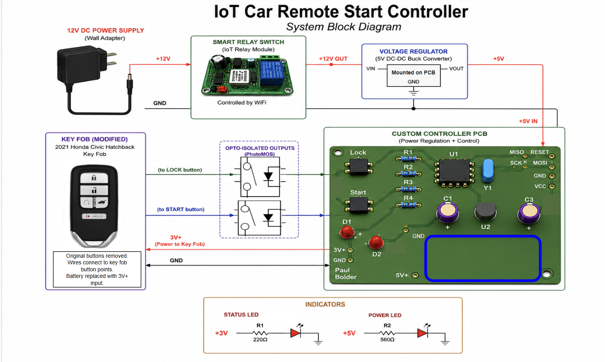

<h1>IoT-Car-Remote-Start-Controller</h1>

 ### [YouTube Demonstration](https://youtu.be/7eJexJVCqJo)


<h2>Description</h2>
Engineered an IoT-enabled vehicle remote start controller for my car. The project included custom circuit design in Altium, PhotoMOS relay isolation for OEM key fob integration, embedded firmware development, and onboard power regulation.
<br />


<h2>Languages and Utilities Used</h2>

- <b>Arduino as ISP</b>
- <b>Altium</b>
- <b>OnShape</b>

<h2>How it Works:</h2>

An IoT relay module remotely powers the system, allowing embedded controller to interface with a modified OEM key fob. PhotoMOS-isolated outputs electronically trigger the lock and remote start button signals while onboard voltage regulation provides stable power to both the controller and key fob circuitry.

<h2>Design and Build Process:</h2>

<p align="center">
Altium Schematic: <br/>

<br />
<br />
Select the disk:  <br/>

<br />
<br />
Enter the number of passes: <br/>

<br />
<br />
Confirm your selection:  <br/>

<br />
<br />
Wait for process to complete (may take some time):  <br/>

<br />
<br />
Sanitization complete:  <br/>

<br />
<br />
Observe the wiped disk:  <br/>

</p>

<!--
 ```diff
- text in red
+ text in green
! text in orange
# text in gray
@@ text in purple (and bold)@@
```
--!>
