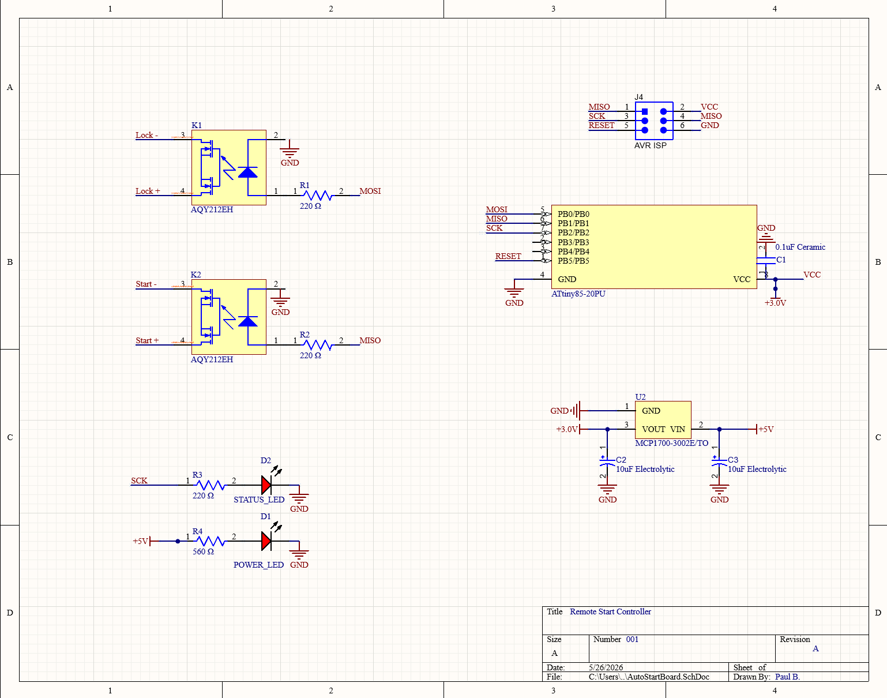
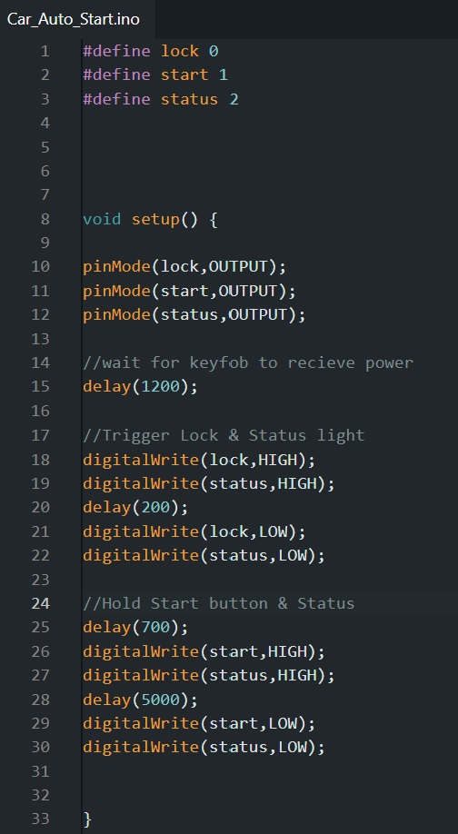
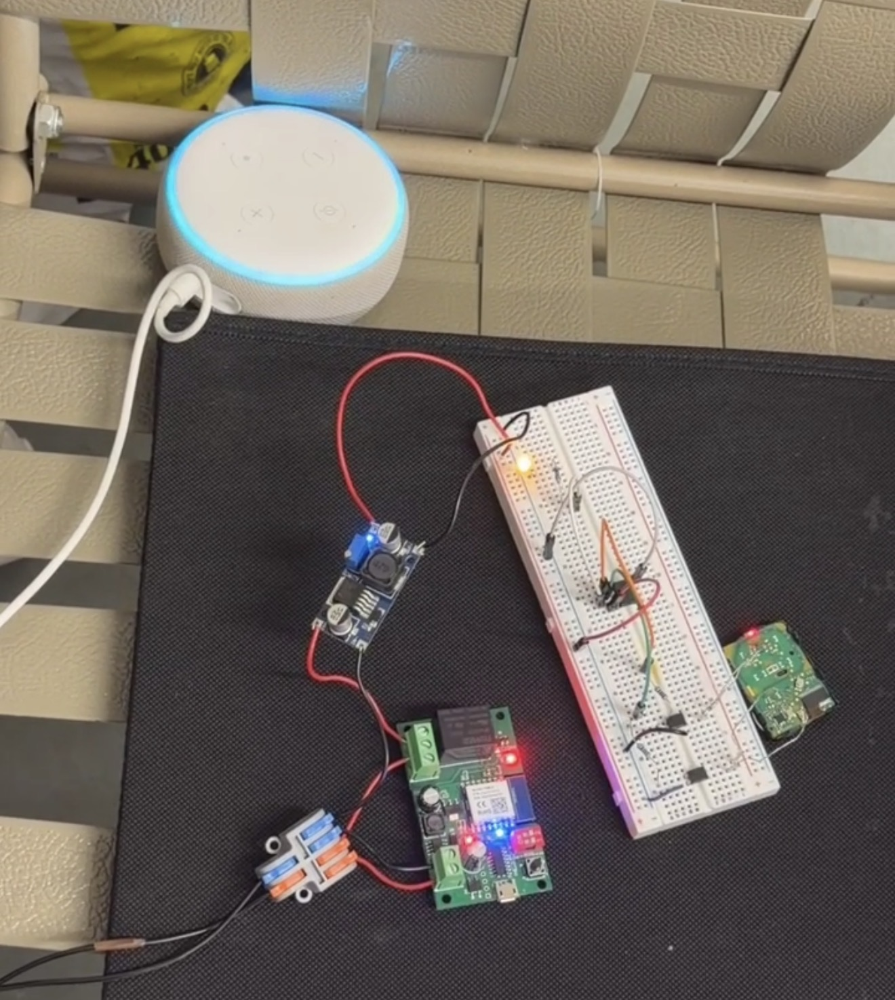
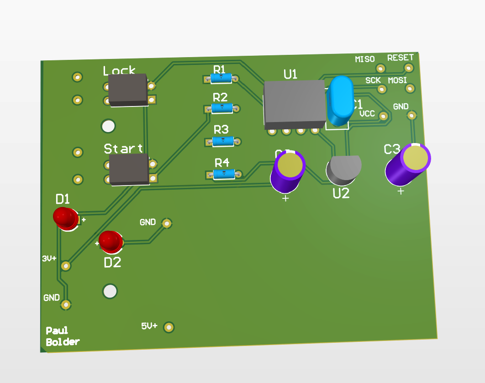
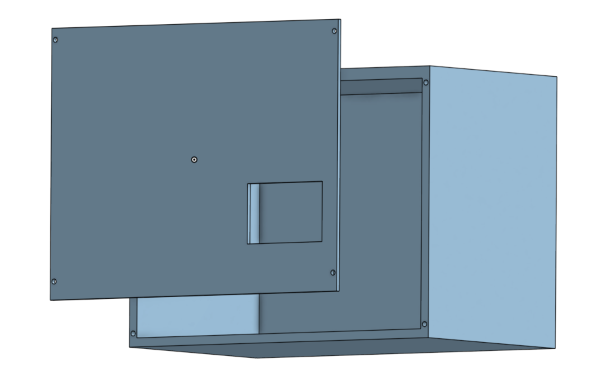
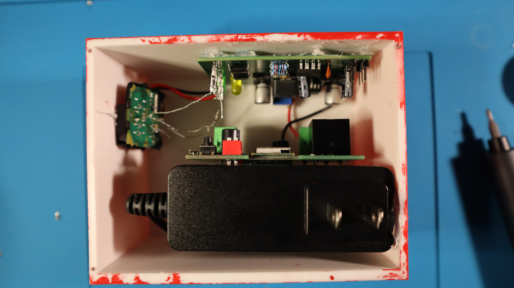
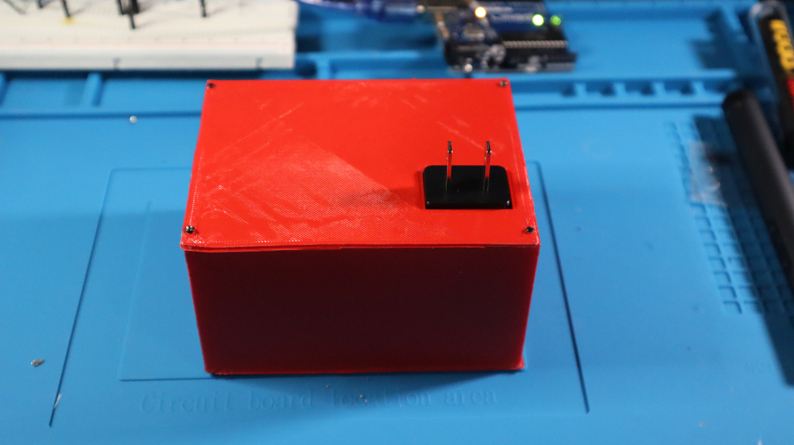

<h1>IoT-Car-Remote-Start-Controller</h1>

 ### [YouTube Demonstration](https://youtube.com/shorts/W13j55whz2U?feature=share)

<h2>Description</h2>
Engineered an IoT-enabled vehicle remote start controller for my car. The project included custom circuit design in Altium, PhotoMOS relay isolation for OEM key fob integration, embedded firmware development, and onboard power regulation.
 

<h2>Languages and Utilities Used</h2>

- <b>Arduino as ISP</b>
- <b>Altium</b>
- <b>OnShape</b>

<h2>How it Works:</h2>

An IoT relay module remotely powers the system, allowing the embedded controller to interface with a modified OEM key fob. 
PhotoMOS-isolated outputs electronically trigger the lock and remote start button signals while onboard voltage regulation 
provides stable power to both the controller and key fob circuitry.

<h2>Design and Build Process:</h2>

Altium Schematic:  

 
 
Arduino as ISP & Breadboard Prototype:   

  
  

The code for the system was uploaded to an ATtiny85 microcontroller using an Arduino Uno as a programmer. Shown is the first working breadboard prototype used to test the smart remote start system and key fob integration before designing the final PCB.

 
 

Altium PCB:  

  
  

The final PCB includes a mounted DC buck converter, ISP programming header, and regulated 3V output used to replace the original key fob battery.
 
 

CAD Casing:   
 
 
 
Finished project:   

  
  

<h1>Author</h1>

Designed and built by [Paul Bolder](https://github.com/Pbolder).
